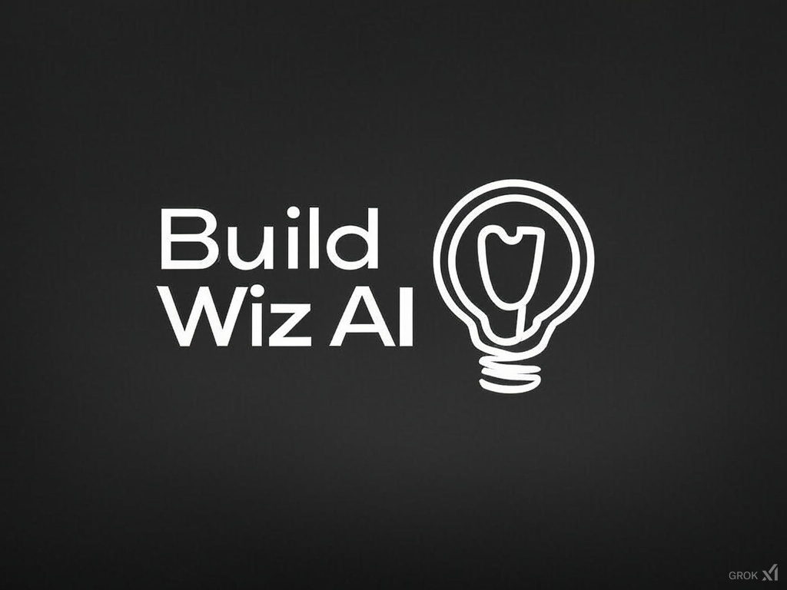

# Build wiz AI 🚀

> Building the future of products with AI-powered innovation

Welcome to my GitHub profile! I'm passionate about leveraging artificial intelligence to create innovative solutions and build amazing products.

## 🔗 Connect With Us
- 🌐 Official Website: [buildwizai.com](https://buildwizai.com)

## 🛠 What We Do
- 🤖 AI-powered product development
- 💡 Innovative solutions
- 🔄 Continuous innovation

## GitHub Stats

## Top Languages

## GitHub Trophy

## 📫 Get in Touch
Feel free to reach out through our [official website](https://buildwizai.com) for collaborations or inquiries.

<!--
**buildwizai/buildwizai** is a ✨ _special_ ✨ repository because its `README.md` (this file) appears on your GitHub profile.
-->
